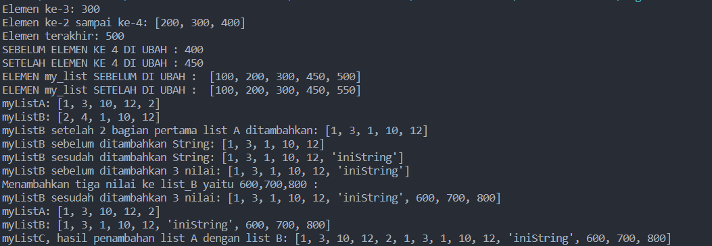
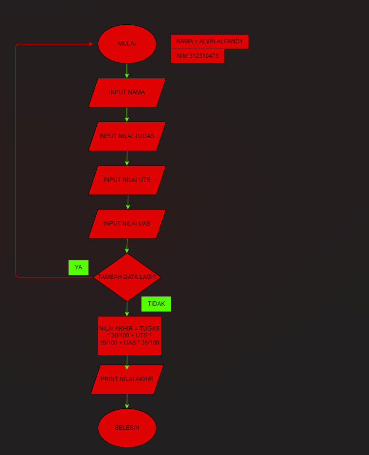
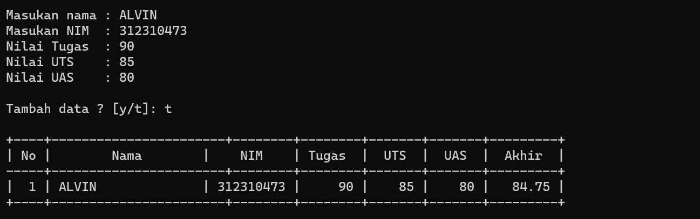

<h1 align="center">
  Pertemuan 9
</h1>


| Variable | Isi |
| -------- | --- |
| **Nama** | ALVIN ALFANDY  |
| **NIM** | 312310473 |
| **Kelas** | TI.23.A.5 |
| **Mata Kuliah** | Bahasa Pemrograman |


## Latihan 
### Buat sebuah list sebanyak 5 elemen dengan nilai bebas 
#### 1. Akses list : 
- Tampilkan elemen ke 3
- Ambil nilai elemen ke 2 sampai elemen ke 4
- Ambil elemen terakhir
#### 2. Ubah elemen list:
- Ubah elemen ke 4 dengan nilai lainnya
- Ubah elemen ke 4 sampai dengan elemen terakhir
#### 3. Tambah elemen list:
- Ambil 2 bagian dari list pertama (A) dan jadikan list ke 2 (B)
- Tambah list B dengan nilai string
- Tambah list B dengan 3 nilai
- Gabungkan list B dengan list A

## 1. Akses list
#### Buat sebuah list sebanyak 5 elemen dengan nilai bebas

```python
my_list = [100, 200, 300, 400, 500]
```
#### Tampilkan elemen ke 3
```python
# Menampilkan elemen ke 3 dari variable my_list yaitu 300
print("Elemen ke-3:", my_list[2]) 
```
#### Ambil nilai elemen ke 2 sampai elemen ke 4
```python
# Menampilkan elemen ke 2 sampai ke 4 dari variable my_list yaitu 300 , 400
print("Elemen ke-2 sampai ke-4:", my_list[1:4])
```
#### Ambil elemen terakhir
```python
# Menampilkan elemen Terakhir dari variable my_list yaitu 500
print("Elemen terakhir:", my_list[-1])
```

## 2.Ubah elemen list:

#### Ubah elemen ke 4 dengan nilai lainnya


```python
# Menampilkan variable my_list Elemen ke 4 Sebelum di ubah
print("SEBELUM ELEMEN KE 4 DI UBAH :", my_list[3])
# Mengubah nilai elemen ke 4 variable my_list menjadi 450
my_list[3] = 450
# Menampilkan variable my_list Elemen ke 4 SebSetelah di ubah
print("SETELAH ELEMEN KE 4 DI UBAH :", my_list[3])

```

#### Ubah elemen ke 4 sampai dengan elemen terakhir
```python
# Menampilkan ELEMEN my_list SEBELUM DI UBAH
print("ELEMEN my_list SEBELUM DI UBAH : ", my_list)
# Menganti nilai ke empat sampai elemen terakhir  menjadi 450,550
my_list[3:] = [450, 550]
# Menampilkan ELEMEN my_list SETELAH DI UBAH
print("ELEMEN my_list SETELAH DI UBAH : ", my_list)

```
## Tambah elemen list:
```python
myListA = [1, 3, 10, 12, 2];
myListB = [2, 4, 1, 10, 12];
```
#### Ambil 2 bagian dari list pertama (A) dan jadikan list ke 2 (B)
```python
#Ambil 2 bagian pertama list A dan jadikan list B
print('myListA:', myListA);
print('myListB:', myListB);
myListB[0:2] = myListA[0:2];
print('myListB setelah 2 bagian pertama list A ditambahkan:', myListB);
```
#### Tambah list B dengan nilai string
```python
print('myListB sebelum ditambahkan String:', myListB)
myListB.append('iniString');
print('myListB sesudah ditambahkan String:', myListB)
```
#### Tambah list B dengan 3 nilai
```python
print('myListB sebelum ditambahkan 3 nilai:', myListB)
# Menambahkan tiga nilai ke list_B yaitu 600,700,800
myListB.extend([600, 700, 800])
print("Menambahkan tiga nilai ke list_B yaitu 600,700,800 :")
print('myListB sesudah ditambahkan 3 nilai:', myListB)
```

#### Gabungkan list B dengan list A
```python
print('myListA:', myListA);
print('myListB:', myListB);
myListC = myListA + myListB;
print('myListC, hasil penambahan list A dengan list B:', myListC);
```

## Hasil peogram


## Tugas praktikum
Buat program sederhana untuk menambahkan data kedalam sebuah
list dengan rincian sebagai berikut:

- Progam meminta memasukkan data sebanyak-banyaknya (gunakanperulangan).

- Tampilkan pertanyaan untuk menambah data (y/t?), apabila jawabant (Tidak), maka program akan menampilkan daftar datanya.

- Nilai Akhir diambil dari perhitungan 3 komponen nilai (tugas: 30%, uts: 35%, uas: 35%).

- Buat flowchart dan penjelasan programnya pada README.md.

- Commit dan push repository ke github.

## Flowchartnya



## Kode program

```Python
# LIST
nama = []
nim = []
nilaiTugas = []
nilaiUTS = []
nilaiUAS = []
nilaiAkhir = []

print()

# Input
while True:
    nama.append(input("Masukan nama : "))
    nim.append(input("Masukan NIM  : "))
    Tugas = int(input("Nilai Tugas  : ")); 
    nilaiTugas.append(Tugas)
    UTS   = int(input("Nilai UTS    : ")); 
    nilaiUTS.append(UTS)
    UAS   = int(input("Nilai UAS    : ")); 
    nilaiUAS.append(UAS)

    nilaiAkhir.append(Tugas * 30/100 + UTS * 35/100 + UAS * 35/100)

    print()
    _tanya = input("Tambah data ? [y/t]: ")
    print()
    if(_tanya == "t"):
        break

# Output
print("+----+-----------------------+--------+--------+-------+-------+---------+")
print("| {0:^2} | {1:^18} | {2:^9} | {3:^6} | {4:^5} | {5:^5} | {6:^7} |".format("No", "Nama", "NIM" v, "Tugas", "UTS", "UAS", "Akhir"))
print("-----+-----------------------+--------+--------+-------+-------+---------+")

no = 0
for nama, nim, Tugas, UTS, UAS, nilaiAkhir in zip(nama, nim, nilaiTugas, nilaiUTS, nilaiUAS, nilaiAkhir):
    no += 1    
    print("| {0:>2} | {1:<18} | {2:>8} | {3:>6} | {4:>5} | {5:>5} | {6:>7} |".format(no, nama, nim, Tugas, UTS, UAS, nilaiAkhir))
print("+----+-----------------------+--------+--------+-------+-------+---------+")
```
## Output program

